# Syntax Error Hotel — Online Check-In Uygulaması

> **Yazılım Mühendisliği Dersi Dönem Projesi**  
> Flutter · Firebase · Cloud Firestore · EmailJS

---

## İçindekiler

- [Proje Hakkında](#proje-hakkında)
- [Özellikler](#özellikler)
- [Mimari ve Teknolojiler](#mimari-ve-teknolojiler)
- [Proje Yapısı](#proje-yapısı)
- [Ekran Görüntüleri](#ekran-görüntüleri)
- [Kurulum ve Çalıştırma](#kurulum-ve-çalıştırma)
- [Veritabanı Şeması](#veritabanı-şeması)

---

## Proje Hakkında

Bu proje, "Syntax Error Hotel" adlı kurgusal bir otelin mobil check-in süreçlerini dijitalleştirmek amacıyla geliştirilmiş bir **Flutter** uygulamasıdır. Uygulama; misafirlerin rezervasyon oluşturmasına, online check-in/check-out yapmasına, oda servisi talep etmesine ve fatura görüntülemesine olanak tanır. Otel yöneticileri ise ayrı bir **Admin Terminal** paneli üzerinden odaları, talepleri ve misafir hareketlerini gerçek zamanlı olarak takip edebilir.

---

## Özellikler

### Misafir Tarafı

| Özellik | Açıklama |
|---|---|
| Kayıt & Giriş | E-posta doğrulamalı (OTP) kullanıcı kaydı, şifreli giriş |
| Rezervasyon Oluşturma | Tarih, gün sayısı, kişi sayısı ve interaktif kat krokisi üzerinden oda seçimi |
| Online Check-in | Rezervasyon kodu ile check-in, QR kod oluşturma |
| Aktif Oda Yönetimi | Oda servisi siparişi, anlık durum takibi |
| Talep Bildir | Teknik arıza, temizlik ve oda servisi kategorilerinde destek talebi |
| Fatura / Geçmiş | Geçmiş konaklamaların listelenmesi, PDF fatura oluşturma ve yazdırma |
| Profil Ayarları | Telefon ve şifre güncelleme |
| Destek Merkezi | Sık sorulan sorular (SSS) accordion listesi |

### Yönetici Tarafı

| Özellik | Açıklama |
|---|---|
| Admin Terminal | Cyberpunk temalı, gerçek zamanlı admin paneli |
| Canlı Oda Durum Haritası | Kat bazlı oda doluluk görünümü (Dolu / Boş / Admin) |
| Aktif Talepler | Misafirlerden gelen tüm servis ve temizlik taleplerinin yönetimi |
| Log Akışı | Sistem hareketlerinin anlık log kaydı |
| Filtreli Görünüm | Tümü / Servis / Temizlik kategorilerine göre talep filtreleme |

---

## Mimari ve Teknolojiler

```
Flutter (Dart)
├── UI Katmanı        → Material 3, özel widget'lar, animasyonlar
├── Servis Katmanı    → FirestoreService (CRUD operasyonları)
├── Model Katmanı     → HotelReservation (Firestore ↔ Dart mapping)
└── Harici Servisler
    ├── Firebase Cloud Firestore  → Gerçek zamanlı veritabanı
    ├── EmailJS                  → OTP e-posta doğrulaması
    ├── qr_flutter               → QR kod üretimi
    └── pdf + printing           → PDF fatura oluşturma
```

**Kullanılan Paketler (`pubspec.yaml`)**

| Paket | Sürüm | Amaç |
|---|---|---|
| `firebase_core` | ^3.0.0 | Firebase bağlantısı |
| `cloud_firestore` | ^5.0.0 | Gerçek zamanlı veritabanı |
| `qr_flutter` | ^4.1.0 | QR kod üretimi |
| `pdf` + `printing` | ^3.10 / ^5.11 | PDF fatura |
| `intl` | ^0.19.0 | Tarih/para formatlaması |
| `http` | ^1.6.0 | EmailJS API entegrasyonu |

---

## Proje Yapısı

```
lib/
├── main.dart                  # Tüm misafir ekranları ve uygulama girişi
├── admin/
│   └── admin_dashboard.dart   # Yönetici paneli
├── models/
│   └── reservation.dart       # HotelReservation veri modeli
├── services/
│   └── firestore_service.dart # Firestore CRUD servisleri
└── firebase_options.dart      # Firebase platform konfigürasyonu
```

---

## Ekran Görüntüleri

### Giriş ve Ana Sayfa

| Giriş | Ana Sayfa |
|:---:|:---:|
| 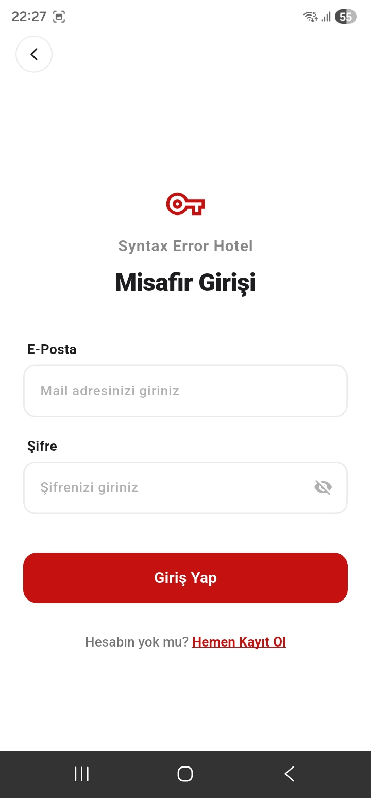 | 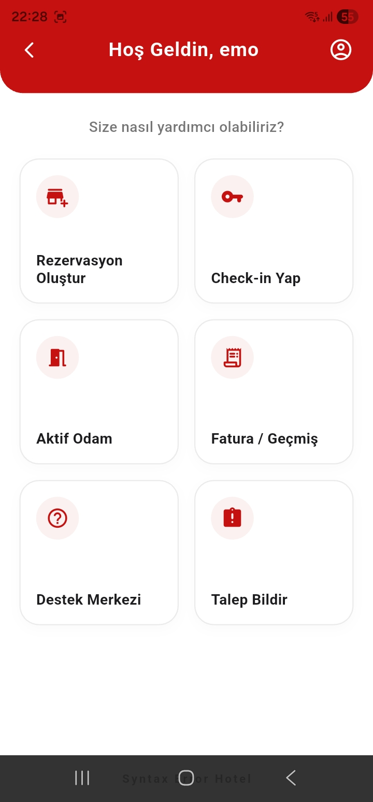 |

### Misafir Ekranları

| Rezervasyon | Konaklama Bilgi Giriş Ekranı |
|:---:|:---:|
| 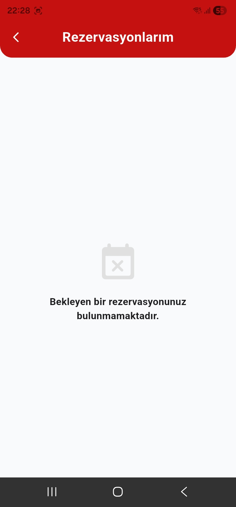 | 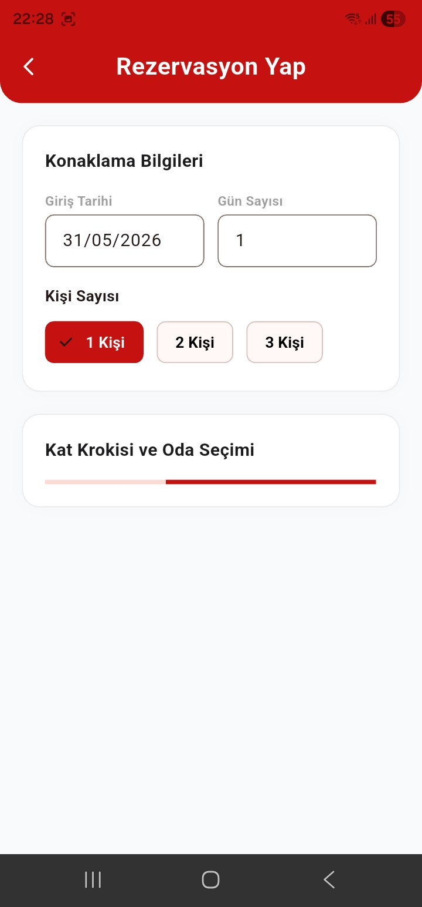 |

| Rezervasyon Ekranı | Talep Ekranı |
|:---:|:---:|
| 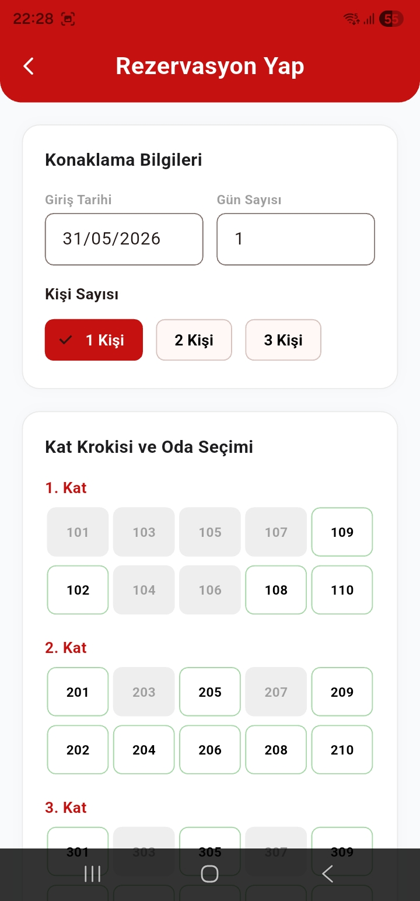 | 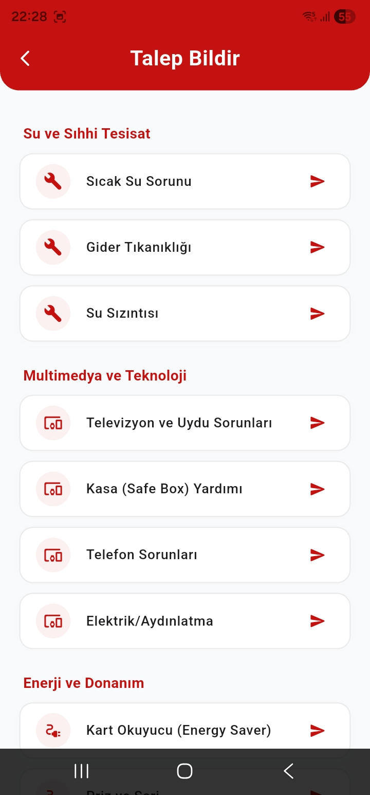 |

| Aktif Odalar | Faturalarım / Geçmiş |
|:---:|:---:|
| 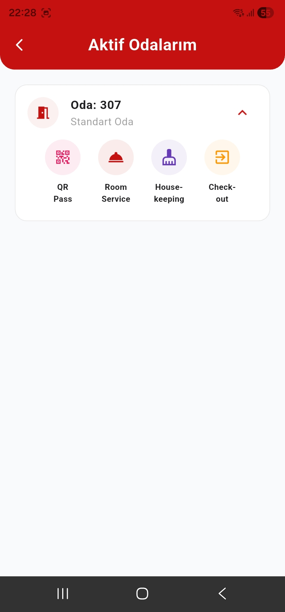 | 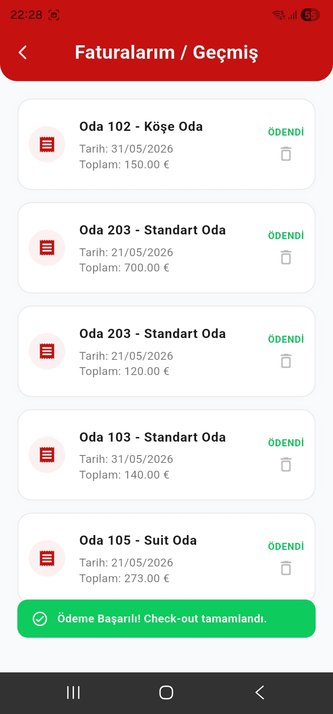 |

| Ana Sayfa | Destek ve Bilgi Merkezi |
|:---:|:---:|
| 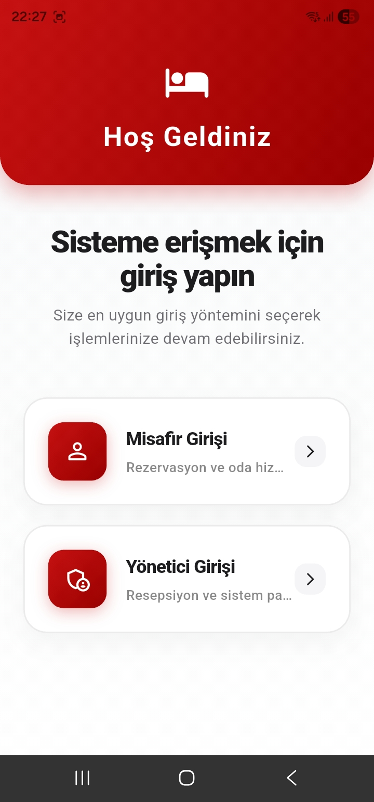 | 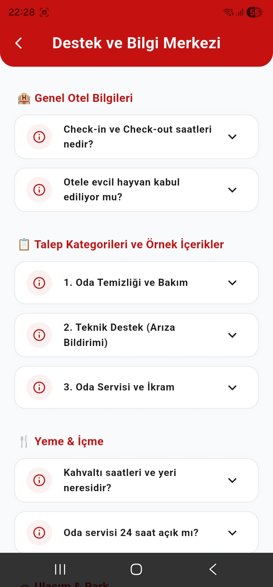 |

### Yönetici Paneli (Admin Terminal)

| Admin Paneli | Admin Paneli | Admin Paneli | Temizlik Admin Paneli |
|:---:|:---:|:---:|:---:|
| 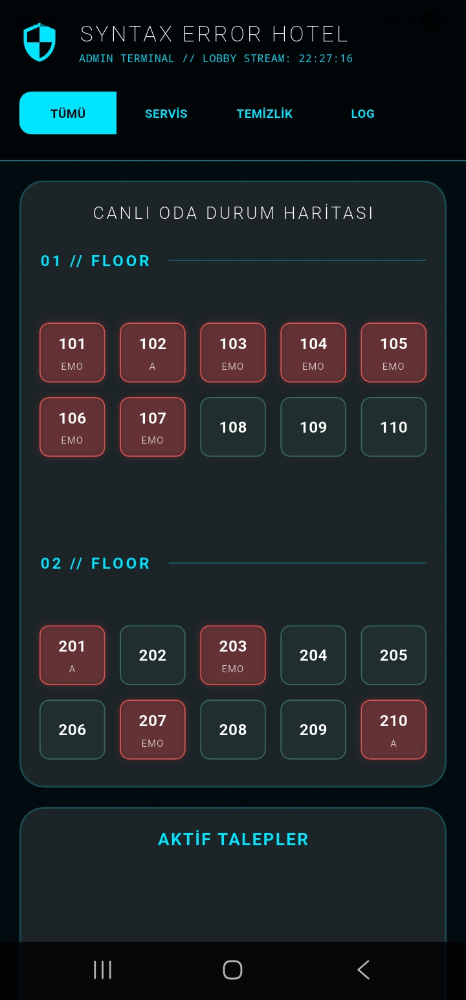 | 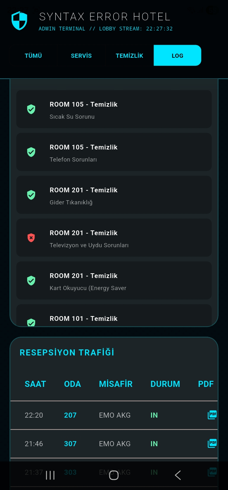 | 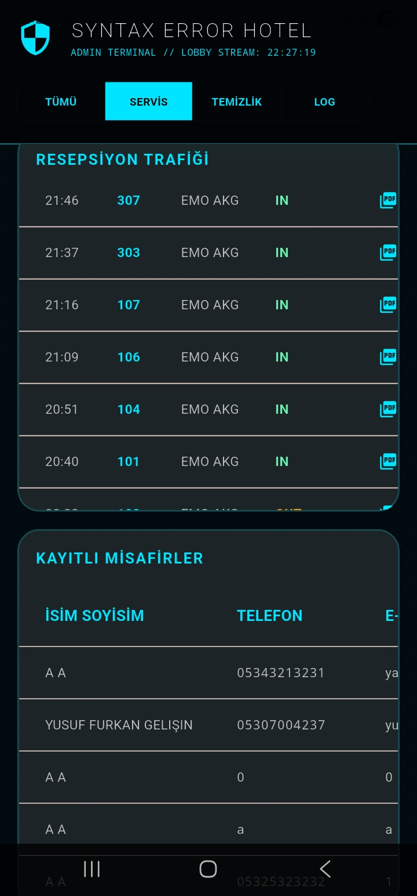 | 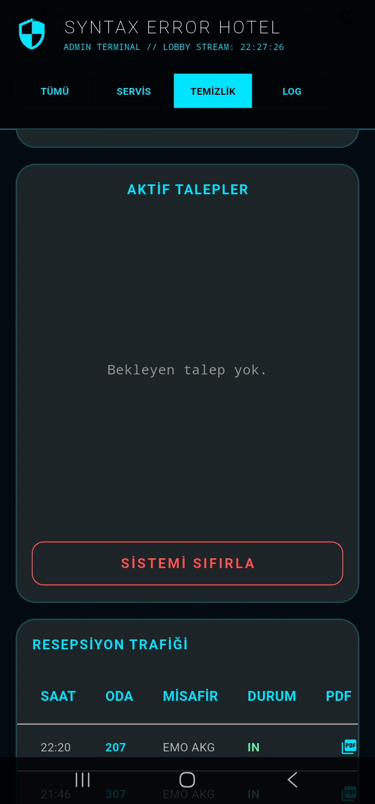 |

---

## Kurulum ve Çalıştırma

### Gereksinimler

- Flutter SDK >= 3.10.4
- Dart SDK >= 3.0
- Android Studio veya VS Code
- Firebase projesi (Firestore aktif)

### Adımlar

```bash
# 1. Repo'yu klonla
git clone https://github.com/DogukanBahsi/Check-In-App.git
cd Check-In-App

# 2. Bağımlılıkları yükle
flutter pub get

# 3. Firebase konfigürasyonunu ayarla
# lib/firebase_options.dart dosyasını kendi Firebase projen ile güncelle

# 4. Uygulamayı çalıştır
flutter run
```

> **Not:** `google-services.json` (Android) ve `GoogleService-Info.plist` (iOS) dosyaları kendi Firebase projenize ait olmalıdır. Repo'daki dosyalar örnek amaçlıdır.

---

## Veritabanı Şeması

### `reservations` Koleksiyonu

| Alan | Tip | Açıklama |
|---|---|---|
| `reservationCode` | String | Benzersiz rezervasyon kodu |
| `name` / `surname` | String | Misafir adı soyadı |
| `identityNumber` | String | TC / Pasaport no |
| `roomNumber` | String | Oda numarası |
| `roomType` | String | Oda tipi |
| `checkInDate` | Timestamp | Giriş tarihi |
| `stayDays` | int | Konaklama süresi (gün) |
| `personCount` | int | Kişi sayısı |
| `isCheckedIn` / `isCheckedOut` | bool | Check-in/out durumu |
| `includeBreakfast` / `includeDinner` | bool | Yemek paketi tercihleri |
| `totalPrice` | double | Toplam ücret (€) |
| `roomServiceOrders` | Array | Oda servisi siparişleri |
| `housekeepingRequests` | Array | Temizlik/teknik talepler |

### `users` Koleksiyonu

| Alan | Tip | Açıklama |
|---|---|---|
| `name` / `surname` | String | Ad soyad |
| `identityNumber` | String | TC / Pasaport no |
| `email` / `password` | String | Giriş bilgileri |
| `phone` | String | Telefon numarası |
| `country` | String | Uyruk |

---

*Syntax Error Hotel — Yazılım Mühendisliği Projesi*
